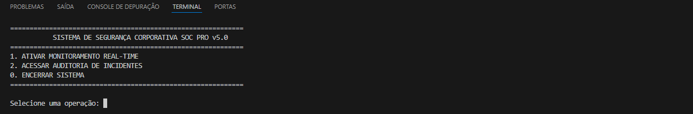
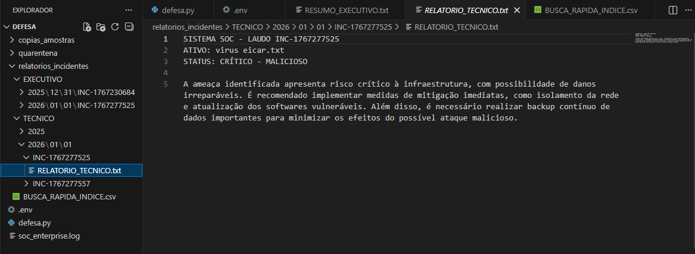
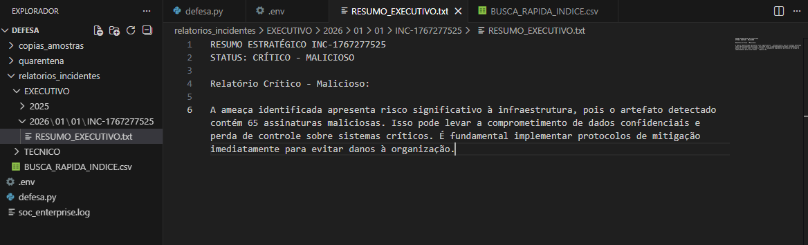
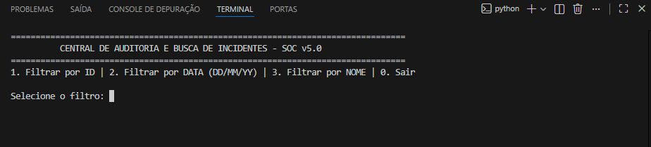
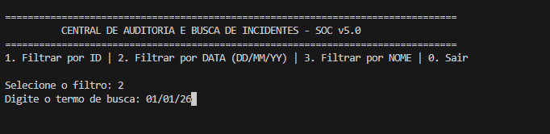
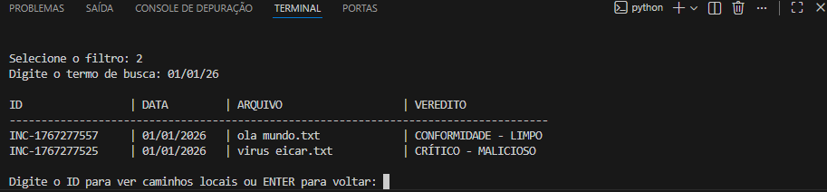

SOC Automation Engine v5.0

Sobre o Projeto
Este repositório contém um motor de automação de segurança desenvolvido para gerenciar o pipeline de resposta a incidentes em sistemas de arquivos. O objetivo central é converter eventos técnicos isolados em documentação estruturada, facilitando a análise técnica e o suporte à tomada de decisão estratégica.
O sistema foi arquitetado para monitorar diretórios, realizar o enriquecimento de dados via Threat Intelligence global, isolar artefatos suspeitos e produzir laudos automatizados utilizando um motor de IA local (LLM – Llama 3 via Ollama).
O projeto é direcionado a estudos em Blue Team, automação defensiva e engenharia de resposta a incidentes.
Nota de Escopo: Este projeto possui caráter demonstrativo e experimental, focado em prova de conceito (PoC). Não visa a substituição de ecossistemas corporativos de EDR, SIEM ou SOAR de mercado.
Funcionalidades Técnicas
Vigilância de Ativos (Real-Time): Monitoramento reativo de diretórios sensíveis através da biblioteca Watchdog.
Enriquecimento de Ameaças (Threat Intelligence): Integração com a API v3 do VirusTotal para validação de reputação baseada em assinaturas criptográficas (SHA-256).
IA Aplicada ao Reporting de Segurança: Utilização do motor de IA local (LLM – Llama 3 via Ollama) configurado para gerar documentação técnica e estratégica baseada em contextos de risco validados.
Protocolo de Custódia: Isolamento automatizado de amostras (quarentena) em estrutura cronológica, assegurando a integridade das evidências para análises posteriores.
Módulo de Auditoria e Busca: Interface para recuperação de histórico baseada em IDs de incidente, normalização flexível de datas e metadados de ativos.
Observabilidade: Logging estruturado (soc_enterprise.log) para rastreabilidade de falhas e sucessos operacionais.
Transparência e Desenvolvimento Aumentado por IA
Este projeto é um exemplo de desenvolvimento acelerado por Inteligência Artificial. Como autor, utilizei modelos de linguagem como parceiros de Pair Programming para auxiliar na construção da lógica de automação e prototipagem.
Minha atuação principal concentrou-se no entendimento e refinamento do pipeline de defesa:
Arquitetura do Pipeline: Definição do fluxo entre as camadas de monitoramento, processamento e persistência.
Engenharia de Prompt: Refinamento técnico das instruções do motor de IA local (LLM – Llama 3 via Ollama) para garantir respostas determinísticas, formais e focadas em cenários reais de SOC.
Aprendizado de Resposta: Análise da velocidade de ameaças e limitações de tempo de resposta em sistemas automatizados.
Segurança: Implementação de gestão de segredos (variáveis de ambiente) e tratamento de exceções.
Estrutura de Diretórios
A organização do projeto segue uma separação lógica entre orquestração, evidências e relatórios:
code
Text
/soc-automation
│
├── defesa.py              # Orquestrador principal do sistema
├── .env                   # Gestão de segredos (Não versionado)
├── .env.example           # Modelo de configuração de ambiente
├── soc_enterprise.log     # Registro de observabilidade
│
├── quarentena/            # Área de ingestão de ativos suspeitos
├── copias_amostras/       # Isolamento seguro de artefatos originais
└── relatorios_incidentes/ # Repositório de laudos técnicos e estratégicos
Demonstração de Operação
O sistema automatiza o ciclo de vida do incidente em três fases principais:
Fase 1: Monitoramento e Resposta em Tempo Real

Fase 2: Produção de Inteligência via LLM

Fase 3: Auditoria e Rastreabilidade

Configuração e Instalação
Ambiente: Python 3.10+ e Ollama com o modelo llama3.
Dependências:
code
Bash
pip install -r requirements.txt
Variáveis de Ambiente:
Configure o arquivo .env com sua credencial da API do VirusTotal conforme o modelo .env.example.
Execução:
code
Bash
python defesa.py
Autor: Kael
Foco: Automação em Blue Team e Engenharia de Software para Cibersegurança.
